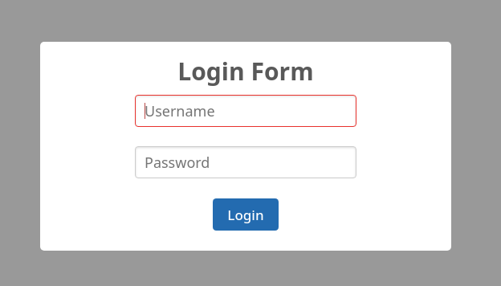

# DEOTrans Code Challenge

Web application & REST API to send an email.

## How To Run

Use `docker-compose` to run local docker containers of the web application, pass the current user id & group id with `USER_ID` & `GROUP_ID` environment variables:

```bash
USER_ID=$(id -u) GROUP_ID=$(id -g) docker-compose up --build
```

Parameter `--build` used to build `web` & `job` docker image from `Dockerfile` & `Dockerfile-job-queue` docker description files, it could be omitted for next startup.

The `USER_ID` & `GROUP_ID` environment variables are used to run the `web` & `job` containers with the same user as the one who execute `docker-compose` command, so the containers could access `keys/private.key` & `keys/public.key`. It can be adjusted with the actual owner user id of the files if changed.

## How To Use

### Authentication

To be able sending email correctly, we need to be authenticated(there's a dummy user **admin** with **pass123** password) using the **Login Form**



### Send Email

After authenticated we can send email using the **Send Email Form**


## System Design

### HTTP Endpoints

#### `GET` /

Redirect to `client.html` page with login & send email form.

#### `POST` /login

Authenticate with JWT response when successful.

##### Parameters

| Name         | Description                                         |
| ------------ | --------------------------------------------------- |
| **username** | User login ID, there's a dummy generated: `admin`   |
| **password** | User password, there's a dummy generated: `pass123` |

*All parameters are required*

##### Responses

| Code | Description                                                  |
| ---- | ------------------------------------------------------------ |
| 200  | Login successful, got `X-API-KEY` header with the JWT authorization token |
| 400  | Required parameters are empty/invalid                        |
| 401  | Login failed, username or password is invalid                |

#### `GET` /api/emails

API to retrieve all emails from DB.

Need to be authorized with `Authorization: bearer token` header.

##### Responses

| Code | Description                                      |
| ---- | ------------------------------------------------ |
| 200  | Request authorized, return all emails JSON array |
| 401  | Request isn't authorized                         |

#### `POST` /api/emails

API to insert email row and create new background job to send email with `sendmail`.

Need to be authorized with `Authorization: bearer token` header.

##### Parameters

| Name         | Description                                        |
| ------------ | -------------------------------------------------- |
| **sender**   | The sender email address, will be the `From` field |
| **receiver** | The receiver email address, will be the `To` field |
| **subject**  | The email subject                                  |
| **message**  | The email body                                     |

*All parameters are required*

##### Responses

| Code | Description                           |
| ---- | ------------------------------------- |
| 200  | Email sent                            |
| 400  | Required parameters are empty/invalid |
| 401  | Request isn't authorized              |

### Send Email Call Flow

#### `POST` /api/emails

```sequence
Browser\n(client.html)->API\n(/api/emails): Request with email details
API\n(/api/emails)->Database: Insert email row
API\n(/api/emails)->Job Queue\nHandler: Produce send email job
API\n(/api/emails)-->Browser\n(client.html): Email sent response
Job Queue\nHandler->Sendmail: Send email
Sendmail-->Job Queue\nHandler: Email delivered
Job Queue\nHandler->Database: Update Email row
```

